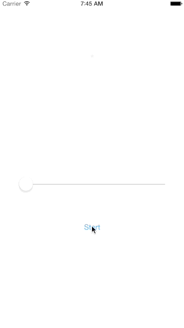

# NaughtyImageView
UIImageView Can Animate Sprite Image Like Twitter Fav action



## Requirements

Swift 1.2, iOS 8.0

## Example

```swift
starImageView.frame = CGRectMake(view.frame.width/2.0 - 32/2.0, 100, 32, 32)

starImageView.setupWithImage(UIImage(named: "fav")!, horizontalImages: 8, verticalImages: 12)

starImageView.startNaughtyAnimation()
```

## Installation

Feel free to drag `NaughtyImageView.swift` to your iOS Project. But it's recommended to use CocoaPods or Carthage.

### CocoaPods

[CocoaPods](http://cocoapods.org) is a dependency manager for Cocoa projects.

CocoaPods 0.36 adds supports for Swift and embedded frameworks. You can install it with the following command:

```bash
$ [sudo] gem install cocoapods
```

To integrate Proposer into your Xcode project using CocoaPods, specify it in your `Podfile`:

```ruby
source 'https://github.com/CocoaPods/Specs.git'
platform :ios, '8.0'
use_frameworks!

pod 'NaughtyImageView'
```

Then, run the following command:

```bash
$ pod install
```

You should open the `{Project}.xcworkspace` instead of the `{Project}.xcodeproj` after you installed anything from CocoaPods.

For more information about how to use CocoaPods, I suggest [this tutorial](http://www.raywenderlich.com/64546/introduction-to-cocoapods-2).


## License

NaughtyImageView is available under the MIT license. See the LICENSE file for more info.
